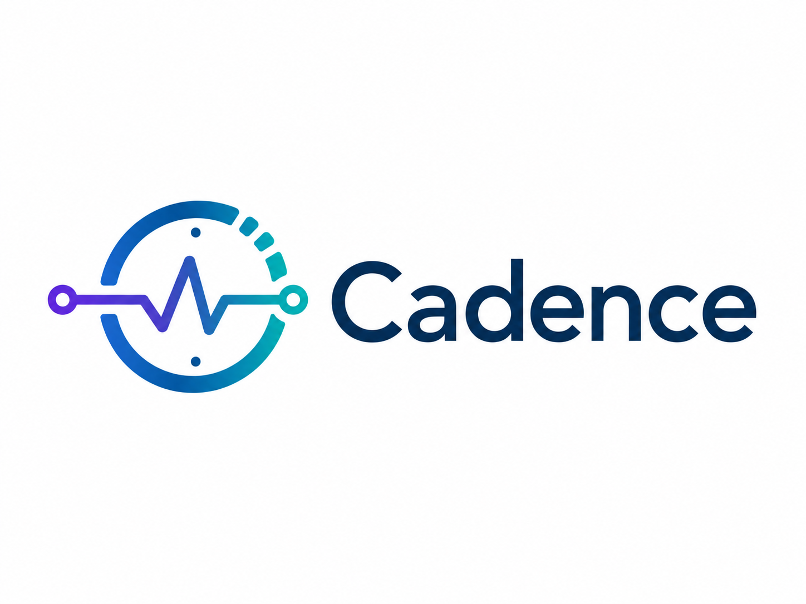

<p align="center">
  
</p>

# 🎼 Cadence

**Your team's rhythm, kept — time, promises, and updates managed inside Slack.**

Built for the [Slack Agent Builder Challenge](https://slackhack.devpost.com/) — *New Slack Agent* track, using **MCP server integration** and the **Real-Time Search API**.

## What it does

Cadence is one agent with eight skills, usable by any team in any department — nothing is hardcoded to a team, project, or channel. Answers are **concise by default**; add "details" to any request for the full version.

### Time (the flagship flows)

> *"Find 45 minutes for me, Priya and Marco this week"*

Reads everyone's calendar through **MCP tools**, computes mutual free slots with a deterministic engine, proposes the top 3 as buttons. One click books the meeting on every attendee's calendar (real event + `.ics` artifact) and posts a confirmation with an **agenda auto-drafted from workspace context** via the Real-Time Search API.

> *"I'm on leave Thursday and Friday — find cover for my meetings"*

Records the leave, finds colleagues **free at the exact times** of your meetings (ranked by co-attendance and load), one click per meeting reassigns it and posts a grounded **handover brief**. Coverage is leave-aware — colleagues who are themselves OOO are skipped; uncoverable meetings are honestly flagged.

### Productivity

| Ask | What happens |
|---|---|
| `Show open promises` | **Promise Keeper** — passively detects commitments ("I'll send the deck by Friday") in channel messages, tracks them with due dates, digest with Done / File-task buttons (tasks filed via MCP `create_task`) |
| `What did I miss in the last 2 days?` | **Catch-Me-Up** — TL;DR + where you were **@-mentioned**, then per-channel highlights (up to 3 each), all linked |
| `Status of project Phoenix?` | **Status Autopilot** — project tracker via MCP `get_project` + freshest Slack chatter, one cited card: health, progress, blockers, risks |
| `Who knows about kubernetes ingress?` | **Who-Knows-What** — mines who actually discusses a topic (SQL over the FTS index), top experts with evidence links + a ready-to-send intro |
| `Compile release notes` | **Release Notes** — turns the week's ship-worthy messages into a categorized changelog, published via MCP `publish_changelog` |
| `Was SSO setup discussed before?` | **Déjà Vu** — a **summary** of what was discussed/decided, plus when & where (dates + permalinks) |
| *(automatic, every morning)* | **Daily Cadence digest** — today's meetings, open promises (overdue first), and yesterday's activity, posted to a channel on schedule (`CADENCE_DIGEST_*` in `.env`) |

## Architecture

```
Slack (Assistant thread / @mention / /schedule / passive channel events)
   │ Socket Mode
Bolt app (slack_app.py, Assistant() middleware, thread-pool concurrency)
   ├─ routing            keyword router + LLM intent (strict schema), regex fallback   intent.py, features/
   ├─ RTS context        assistant.search.context, 3 tiers, honest attribution        context_search.py
   ├─ MCP client         stdio subprocess, background asyncio thread                  mcp_client.py
   │     └─ MCP server   FastMCP, 10 tools: calendars (6) + tasks/projects/changelog  mcp_server/calendar_tools.py
   ├─ store              SQLite + FTS5: message cache, promise registry               store.py
   ├─ engines            deterministic slots + coverage matching                      slots.py
   └─ features           6 pluggable skills + daily digest, shared contract, scan hooks  features/*.py, digest.py
```

**Design rules:**
- *LLM only at the edges* (intent parsing, drafting) — scheduling, coverage, search, and detection are deterministic and unit-tested; every LLM call has a deterministic fallback, so the app runs fully without an API key.
- *Built for big workspaces* — messages land in a SQLite store with an FTS5 full-text index; topic search, expertise mining, and duplicate detection are single indexed queries (bm25-ranked), so cost scales with results, not history. Channel syncs are incremental; WAL mode + per-thread connections handle Bolt's concurrent listeners.
- *Multi-user parallel* — each Slack event runs on its own worker thread; fan-out work uses a thread pool.
- *Honest cards* — every confirmation footer names its sources (Real-Time Search vs channel history, which MCP tool ran).

## Setup

Requires Python 3.11+.

```bash
cd cadence
python3 -m venv .venv && source .venv/bin/activate
pip install -r requirements.txt
python scripts/gen_calendars.py        # demo calendars, anchored to next business week
```

Verify everything without Slack:

```bash
PYTHONPATH=src python -m unittest discover -s tests               # 140 tests
PYTHONPATH=src python tests/integration/test_mcp_roundtrip.py     # MCP over stdio
PYTHONPATH=src python tests/integration/test_pipeline.py          # both time flows
PYTHONPATH=src python tests/integration/test_features_pipeline.py # all six skills
# or run everything at once:  ./scripts/verify.sh
```

## Slack setup

1. https://api.slack.com/apps → *Create New App* → *From a manifest* → paste `manifest.json`.
2. Install to your workspace; copy tokens into `.env` (from `.env.example`):
   - `SLACK_BOT_TOKEN` (`xoxb-…`) — OAuth & Permissions
   - `SLACK_APP_TOKEN` (`xapp-…`) — Basic Information → App-Level Tokens, scope `connections:write`
   - `SLACK_USER_TOKEN` (`xoxp-…`, optional) — enables user-token Real-Time Search + human-authored seeding
   - `ANTHROPIC_API_KEY` (optional) — LLM intent parsing + drafted agendas/briefs
3. Seed demo material: `python scripts/seed_channel.py`
4. `python app.py` → `⚡️ Bolt app is running!`
5. Invite the bot to channels you want it to read: `/invite @Cadence`

## Why this fits the hackathon

- **MCP server integration** — a real stdio MCP server owns every side effect: calendar reads/writes, task filing, project tracker, changelog publishing. The Slack app is an MCP client; you can watch every tool call in the terminal.
- **Real-Time Search API** — agendas and handover briefs are grounded via `assistant.search.context` (bot-token → user-token → history fallback) with the retrieval source reported on every card.
- **Slack agent surfaces** — first-class `Assistant()` middleware with suggested prompts and live status, app mentions, slash command, App Home, passive channel intelligence, interactive Block Kit throughout.

## Quality process

The codebase went through an adversarial review: 51 reviewer agents across six lenses (concurrency, scale & rate limits, time math, Slack API contracts, failure modes, output quality) produced 43 independently verified findings; the demo-impacting ones are fixed and regression-tested, the rest are documented honestly in [KNOWN_LIMITS.md](KNOWN_LIMITS.md).
